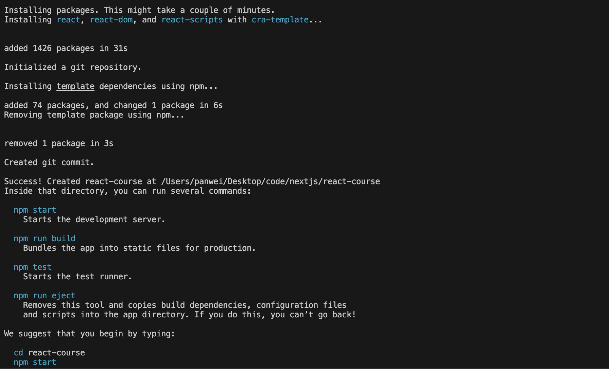
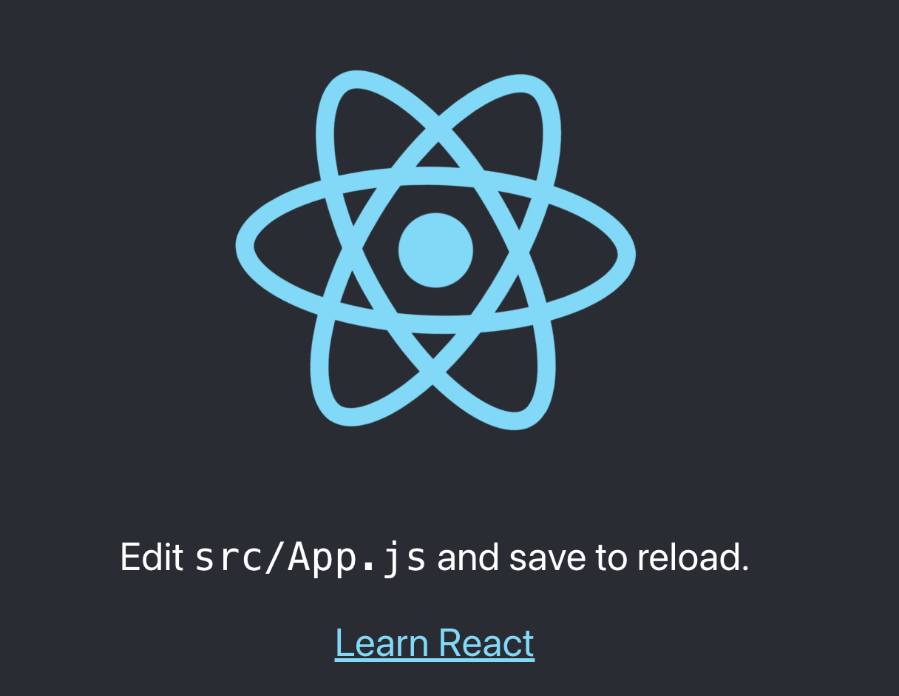

# WTF JavaScript 极简教程 23. React 入门

## WTF JavaScript 教程，帮助新人快速入门 JavaScript。

**推特**：[@WTFAcademy\_](https://twitter.com/WTFAcademy_)  ｜  [@0xAA_Science](https://twitter.com/0xAA_Science)

**WTF Academy 社群：** [官网 wtf.academy](https://wtf.academy/) | [WTF Solidity 教程](https://github.com/AmazingAng/WTFSolidity) | [discord](https://discord.wtf.academy/) | [微信群申请](https://docs.google.com/forms/d/e/1FAIpQLSe4KGT8Sh6sJ7hedQRuIYirOoZK_85miz3dw7vA1-YjodgJ-A/viewform?usp=sf_link)

所有代码和教程开源在 github: [github.com/WTFAcademy/WTF-Javascript](https://github.com/WTFAcademy/WTF-Javascript)

---

AJAX + DOM 使得局部刷新成为了可能，服务器只需提供数据接口，无需考虑页面的渲染，服务器的复杂度降低了，但是前端的复杂度提高了。在前端开发中迫切需要能够根据不同的数据快速构建用户界面（UI）的工具，于是 React、Angular、Vue 等前端框架应运而生。

React 是一个用于构建用户界面的 JavaScript 库，通常被视为 MVC 架构中的“V”（视图）部分，下面是它的一些特点和优势：

- 单页面应用：React 单页面应用（Single-Page Application, SPA）是一种基于 React 框架构建的 Web 应用程序，它在初始加载时只获取一个 HTML 文件（通常是 index.html），之后通过 React 使用 JavaScript 来接管和控制 DOM 和页面的渲染，而不需要向服务器请求新的 HTML 页面并等待。
- JSX 语法: React 框架在 JavaScript 代码中直接嵌入 HTML，使用 JSX(JavaScript XML )语法将 HTML 标签转换为 React 元素并在 JavaScript 中使用这些元素，结合了前端开发的表示层和逻辑层。
- 组件化开发：React 使用组件化的思想，将界面拆分为独立的、可重用的部分。
- 虚拟 DOM：React 采用虚拟 DOM 技术，通过最小化 DOM 操作来提高性能。
- 单向数据流：数据从父组件流向子组件，子组件通过回调函数等将数据的变化通知给父组件。
- 路由管理：使用 React Router 库来管理不同路由路径和对应的组件，实现动态切换和渲染不同的内容。
- 原生应用开发：除了 Web 应用，React 还有 React Native 框架，可以用 JavaScript 开发原生移动应用程序。

这一章是 React 快速入门，我们将主要讲解使用 React 开发 Web 项目。

---

## 1、创建 React 项目

在开始 React 项目之前，设置一个开发环境：

- 安装 VSCode 和 Node.js
- 创建 React 项目和启动 React 开发服务器
- React 项目结构： public（index.html）、src(index.js)、package.json 等；

### 步骤 1：安装[VSCode](https://code.visualstudio.com/download)和[Node.js](https://nodejs.org/zh-cn/download/)

- 首先，确保计算机上已安装 Node.js，可以从 Node.js 官方网站下载并安装适合的操作系统的版本。
- **Node.js** 允许在浏览器外运行 javascript，创建和使用 React 项目, 加载开发服务器，代码转换(将编写的代码转换成浏览器中运行的代码)等；
- 安装完成后，可以在终端或命令提示符中运行以下命令来验证 Node.js 和 npm 是否已成功安装：

```
node -v;
npm -v;
```

### 步骤 2：创建一个新的 React 项目

- 使用 create-react-app 工具可以快速创建一个新的 React 项目。这个命令将会创建一个项目名称为`wtf-app`的新目录，并在其中生成 React 项目的初始文件和目录结构。

```
npx create-react-app wtf-app
```

创建项目成功会显示：


### 步骤 3：启动 React 开发服务器

- 进入新创建的 React 项目目录，npm start 启动开发服务器，关闭开发服务器则是 ctrl + c。

```
cd my-app
npm start
```

这时候浏览器打开 http://localhost:3000/ 就会输出：



### 步骤 4：React 的项目结构

React 项目主要涉及以下几个部分：

```
wtf-app
├── public
│   ├── index.html
├── src
│   ├── App.js
│   ├── index.css
│   ├── index.html
├── .gitignore
├── package-lock.json
├── package.json
└── README.md
```

- public 目录用于存放首页模版及静态资源，除了 index.html 都可以删除。
  - index.html 首页模版用于设置页面结构和引入外部资源，例如 CSS 和 JavaScript 文件。
  - 可以删除的文件包括：favicon.ico （收藏夹图标）、logoxxx.png （React 的 Logo）、manifest.json （PWA 的配置文件）、robots.txt（搜索引擎配置文件）。
- src 目录存放 React 应用的源代码的文件夹，除了 index.css 都可以删除。
  - index.js 项目入口文件，引入 React 和 ReactDOM，并将根组件（App.js）渲染到指定的 DOM 元素上。
  - 可以删除的文件包括：index.css (index.js 的样式表，可改可删)、App.js(根组件，可改可删)、App.test.js（测试）, logo.svg, reportWebVitals.js（统计应用性能）, setupTests.js（测试）, App.css 。
- Package.Json 列出了该项目的所有依赖项 dependencies 和 脚本命令 scripts。
  - start：启动项目的开发服务器.
  - build：将项目打包为静态文件，用于部署到生产环境。
  - test：运行项目的测试套件。
  - eject：手动配置 webpack。

**index.html 示例** ：<div id="root"></div>是 React 应用的根节点，React 会将整个应用渲染到这个 div 元素中；<title>WTF React Course</title> 定义了页面的标题，即在浏览器标签栏中显示的标题。

```jsx
<!DOCTYPE html>
<html lang="en">
  <head>
    <meta charset="utf-8" />
    <meta name="viewport" content="width=device-width, initial-scale=1" />
    <meta name="theme-color" content="#000000" />
    <meta
      name="description"
      content="Web site created using create-react-app"
    />
    <title>React App</title>
  </head>
  <body>
    <div id="root"></div>
  </body>
</html>
```

**Index.js 示例** ：使用 react 需要引入 react 核心库 react, 使用 react 开发 web 应用时必须引入 React 的 dom 包，ReactDOM/client 模块 表示只需要客户端渲染，不需要其他功能（例如服务端渲染）。在 React 中，我们通常不直接操作 DOM，而是通过使用 React 提供的虚拟 DOM 进行界面的构建和更新。虚拟 DOM 是 React 的一个重要概念，它是一个轻量级的 JavaScript 对象，代表了真实 DOM 的抽象。虚拟 DOM 引入了 diff 算法，在更新时会比较新建的元素和旧的元素，只对发生变化的部分进行更新，减少 DOM 的操作，提升了性能。要将 React 元素渲染到 DOM 中，可以使用 ReactDOM.createRoot()方法，通过指定要渲染的 React 元素（例如根组件<App />）和要渲染到的目标 DOM 容器（例如 document.getElementById('root')），将 React 元素渲染到 HTML 页面的指定位置。

```jsx
import React from "react";
import ReactDOM from "react-dom/client";
import "./index.css";
import App from "./App";

const root = ReactDOM.createRoot(document.getElementById("root"));
root.render(<App />);
```

## 2、Component 组件

React 组件是构建用户界面的独立、可重用的部分。为了提高代码的可维护性和复用性，将 React 中的网页拆分为更小的、独立的子组件，每个组件负责特定的渲染逻辑、功能或 UI 部分。然后，在根组件中通过简单地引入和使用这些子组件来构建完整的应用：

- 两类组件：React 组件可以是函数组件或类组件。
- 组合和嵌套：组件可以被重用并在其他组件中导入和使用，通过组合和嵌套来构建整体界面。
- 动态传参：props
- 声明式编程：JSX 是 JavaScript 的语法扩展。
- 虚拟 DOM：React 中进行 DOM 操作的一些常见场景和方法
  - 渲染元素到 DOM
  - 处理事件 Event
  - State 更新元素的属性和内容

### 创建和使用函数组件

函数组件适用于只有`render`方法的简单渲染逻辑的组件。函数组件就是一个标准的 Javascript 函数，区别就是返回的是 JSX 代码。JSX 是 JavaScript 的语法扩展，体现了 React 的声明式(以结果为导向的)编程，在 javascript 中使用 html，直接编写出网页结构，React 会使用 Babel 等工具把 JSX 自动转换成 JS 代码。函数组件使用方法也不是像调用函数一样，而是像使用 HTML 标签一样。

- 创建和使用组件：
  - 创建组件的快捷方式： rsc、rsi 带 props、类组件 rcc。
  - 组件结构：除了根组件 App.js，其他组件通常放在 src 源文件目录的 component 目录中。
  - 导入导出：组件通过 export 导出，在其他文件中使用时先通过 import 导入，然后通过<组件名/>或<组件名></组件名>即可引入组件。
- JSX 语法：
  - 根标签：有且只有一个根标签，不想使用额外的父元素包裹 JSX 元素，可以使用 Fragment（或空标签）作为根元素。
  - 自定义和内置 HTML 元素：React 用大小写区分自定义元素(首字母大写)和内置 HTML 元素小写）。
  - 属性：HTML 和 JSX 的属性使用基本相同（class 使用 className，style 必须用{}，for 使用 htmlFor 等），非字符串类型的属性值不需要使用引号。
  - 子元素：JSX 中的子元素可以是其他 JSX 元素、纯文本或 JavaScript 表达式。

以下是一个使用 JSX 编写的函数组件的示例代码：

```JSX
//App.js
import React from "react";
import Groups from "./components/Groups";

function App() {
  return (
    <div>
      <h1>我的学习小组</h1>
      <Groups />
    </div>
  );
}

export default App;
```

或者推荐使用箭头函数: 绑定了词法作用域的 this 值，使得访问和操作组件上下文更加方便和直观

```JSX
import React from "react";
import Groups from "./components/Groups";

const App = () => {
  return (
    <div>
      <h1>我的学习小组</h1>
      <Groups />
    </div>
  );
}

export default App;
```

与以下使用 React.createElement()的等效代码进行对比，JSX 简直太方便啦：

```javascript
import React from "react";
import Groups from "./components/Groups";

const App = () => {
  return React.createElement(
    "div",
    null,
    React.createElement("h1", null, "我的学习小组"),
    React.createElement(Groups, null)
  );
};

export default App;
```

### Props

组件的内容可以是固定的硬编码，也可以是动态显示，通过的向组件传递参数的形式来向组件传递数据。函数通过实参传递数据，而组件的参数是通过属性传递，这个参数通常会命名为 props，我们可以通过 props 属性将数据从父组件传递给子组件：

- 通过**props.属性名称**访问外部传递进来的属性。
- 通过**props.children**访问传递进来的标签体的内容。
- props 属性是只读的，子组件无法直接修改 props 的属性值。

```javascript
//父组件
import React from "react";
import Group from "./components/Groups";

const App = () => {
  const greeting = "童鞋, WTF 学习小组欢迎你!";

  return (
    <div>
      <Groups greeting={greeting}>快来发起或加入我们的学习小组啦！</Groups>
    </div>
  );
};

export default App;

//子组件
import React from "react";

const Groups = (props) => {
  return (
    <div>
      <h1>{props.greeting}</h1>
      <p>{props.children}</p>
    </div>
  );
}

export default Groups;
```

### Event

在 React 中，处理事件与处理 DOM 元素上的事件非常相似。但是，有一些语法上的差异：

- React 事件使用驼峰命名法，而不是小写字母。
- 使用 JSX 时，事件属性值需要的是一个回调函数，而不是字符串。
- React 提供的事件对象在函数中以参数的形式传入.
- 在 React 中，不能直接使用 return false 来阻止默认行为，而是需要显式地调用 event.preventDefault() 取消默认行为，e.stopPropagation()取消事件的传播。
- React 使用合成事件（Synthetic Event）来处理 DOM 事件，不需要担心跨浏览器兼容性问题。

创建事件处理函数：

```jsx
const submitHandler = (e) => {
  //阻止表单的默认提交行为
  event.preventDefault();
  // 取消事件的传播
  e.stopPropagation();
  console.log(e);
};
```

React 中的事件处理类似于在 HTML 标签中通过属性来设置事件：

```JSX
    <button onSubmit={submitHandler}>创建小组</button>
```

### 类组件的 Props、事件处理和 State

类组件是一种使用 ES6 类语法定义的组件，适用于复杂的组件和需要处理用户交互的场景。

- 类组件的定义和继承：要创建一个 React 类组件，需要继承自 React.Component，并在类中添加一个 render()方法来返回 JSX。
- props：props 存储在类的实例对象中，可以直接使用，无需额外定义,通过 this.props 来访问传递给组件的 props
- state：state 用于存储组件的内部状态。在类组件中，可以通过在类的实例对象中定义 state 属性来管理状态。可以使用 this.state 来访问状态的值。
  - 使用 setState()更新状态：不需要进行浅复制，只需传入要修改的状态属性即可。
- 事件处理：使用类的方法来定义事件处理方法，通常使用箭头函数来确保方法内部的 this 指向组件实例。
- 创建 DOM 容器的引用：可以使用 React.createRef()方法创建一个属性来存储 DOM 对象的引用。在 render()方法中，可以使用 ref 属性将 DOM 对象与引用关联起来。

在使用 ES6 类定义组件时，常见的模式是将事件处理函数定义为类的方法。在方法内部使用 this 关键字时，需要绑定方法的 this 上下文，以确保函数内部的 this 指向组件实例。

下面是一个示例，演示了如何在组件中处理点击事件：

```JSX
class ToggleButton extends React.Component {
  constructor(props) {
    super(props);
    this.state = {
      isToggleOn: false
    };
    // 绑定方法的this上下文
    this.handleClick = this.handleClick.bind(this);
  }

  handleClick() {
    this.setState(prevState => ({
      isToggleOn: !prevState.isToggleOn
    }));
  }

  render() {
    return (
      <button onClick={this.handleClick}>
        {this.state.isToggleOn ? 'ON' : 'OFF'}
      </button>
    );
  }
}
```

这个组件类仅仅是一个按钮，但可以看到，使用起来并不方便，所以在 React 中类组件的使用场景越来越少。但是 ，函数组件必须是纯函数，不能包含状态，也不支持生命周期方法，因此无法取代类。

## 3、常用钩子函数 Hooks

React Hooks 横空出世，其设计目的就是加强版函数组件，完全不使用"类"，就能写出一个全功能的组件。Hooks 让所有组件都能变成 Function，和麻烦的生命周期方法说 bye-bye，不在因为组件中的 this 指向而晕头转向。React Hooks 的意思是，组件尽量写成纯函数，如果需要外部功能和副作用，就用钩子把外部代码"钩"进来，钩子一律使用 use 前缀命名 useXxx。钩子只能在 React 组件和自定义钩子中使用，不能在嵌套函数或其他语句（if、switch、white、for 等）中使用。

下面介绍 React 默认提供的四个最常用的钩子。

- useRef() 获取操作原生 DOM
- useState() 状态管理
- 缓存避免重复渲染
  - useMemo()缓存函数的执行结果，避免重复计算。
  - useCallback 缓存函数对象，避免不必要的函数重新创建。
- useEffect() 处理副作用
- useContext() 组件之间共享数据(下一小节)
- useReducer() 管理复杂的状态逻辑，类似于 Redux 中的 reducer。
- 自定义钩子：封装组件中的重复代码，方便复用

### useRef 钩子函数获取和操作原生 DOM 对象

- 通常，使用 ref 在用户提交表单时获取输入值更为方便（useState 钩子函数结合 onChange 事件来跟踪每次输入适用于需要实时跟踪输入变化的情况，例如实时搜索功能），使用 state 改变屏幕的输出。
- 使用 useRef()钩子函数来创建一个对象，该对象将用于存储 DOM 引用，useRef 还可以用于存储其他类型的值。
- useRef()创建的对象在组件的每次重渲染中保持不变，而手动创建的对象会在每次渲染时重新创建。
- 将 ref 属性添加到需要获取引用的元素上，使用 ref.current 来访问原生 DOM 对象，可以调用其方法和属性。

```jsx
import React, { useRef } from "react";

const NewForm = (props) => {
  const inputRef = useRef();

  const submitHandler = (event) => {
    event.preventDefault();
    const value = inputRef.current.value;
  };

  return (
    <form onSubmit={submitHandler}>
      <input type="text" ref={inputRef} />
      <button type="submit">提交</button>
    </form>;)
};

export default NewForm;
```

### useState Hook 管理组件状态

在 React 中，我们不直接修改 DOM 元素的属性和内容，而是通过修改组件的状态（state）来更新元素的属性和内容。当状态发生变化时，React 会自动更新对应的虚拟 DOM 并重新渲染到真实 DOM 中。在 React 中，我们可以使用 useState Hook 来管理组件的状态。useState Hook 允许组件拥有自己的内部状态，可以更新和访问该状态。

- state 和 props 类似，都是一种存储属性的方式，但是它们具有以下基本区别：

  - Props 是从父组件传递给子组件的数据。它是只读的，子组件无法直接修改 props 的值，这使得 React 组件不能随着 props 的改变而改变。
  - React 提供了 state 用来解决这个问题。State 是组件内部的可变数据，用于在数据发生变化时重新渲染组件。它只能在组件内部使用，且可以通过 setState 方法进行更新。

- 在函数组件中使用 State
  - 导入 useState Hook：
    - 在使用 useState Hook 之前，需要将其导入到组件中。
  - 创建状态变量：
    - 使用 useState Hook 可以创建一个状态变量。
    - useState Hook 接收一个初始值，并返回一个包含状态变量和更新函数 setXxxx 的数组。
  - 更新状态变量：
    - 使用更新函数来更新状态变量的值。
    - 更新函数可以接受新的值作为参数，也可以接受一个函数，该函数返回新的值。

```jsx
import React, { useState } from "react";

const Example = () => {
  const [count, setCount] = useState(0);
  // count是状态变量，初始值为0
  // setCount是用于更新count的函数

  const handleIncrement = () => {
    setCount(count + 1);
  };

  return (
    <div>
      <p>Count: {count}</p>
      <button onClick={handleIncrement}>增加</button>
    </div>
  );
};

export default Example;
```

- 注意事项：
  - state 的值是对象时要浅复制。
    - 这样可以避免直接修改原始的 state 对象，因为 React 可能无法正确检测到 state 的变化。
    - 使用 Object.assign()函数或展开运算符来创建新的对象并修改其中的属性。
  - setState()的异步性质
    - React 中的 setState()是异步完成的，调用完 setState()后状态不会立即改变，而是需要一段时间。
    - 某些情况下，连续点击按钮时可能无法正确获取上一个 state 的值，因为点击的间隔时间不足以让状态更新完成。
    - 使用回调函数来修改 state，确保在上一次 setState()调用完成后才进行下一次调用。
    - 使用回调函数的参数来获取最新的 state 值。
  - 缓存避免重复渲染
    - 原理：
      - React 组件两种情况下重新渲染：一是组件自身的 state 发生变化时，二是组件的父组件重新渲染时。
      - 避免了不必要的重新渲染：state 发生变化时组件才会重新渲染，没有发生变化时直接返回缓存的渲染结果。
    - 方法：
      - React.memo()：React.memo()是一个高阶函数，对组件进行缓存，组件的 props 没有变化时直接返回缓存的组件渲染结果。
      - useMemo()缓存函数的执行结果。
      - useCallback 缓存函数对象。

下面是 state 的值是对象时要浅复制的示例：

```JSX
//
const [group, setGroup] useState({
 title: "春天学习小组",
 description: "今天你学了没？",
});

//用Object.assign()来创建一个新的对象并修改其中的属性
const updateGroup = () => {
  const newGroup = Object.assign({}, group);
  newGroup.title = '夏天学习小组';
  setGroup(newGroup);
};

//另一种更简洁的方法是使用展开运算符（spread operator）来进行浅复制和修改：
const updateGroup = () => {
  setGroup({ ...user, title: '夏天学习小组' });
};
```

下面是 setState()的异步性质的示例：

```JSX
const handleIncrement = () => {
    setCount((prevCount)=>{
        return prevCount + 1;
    });
};

//更简单的写法
const handleIncrement = () => {
    setCount(prevCount => prevCount + 1);
};
```

下面是 React.memo()缓存避免重复渲染的示例：

```JSX
//修改Groups组件的导出语句
export default React.memo(Groups);
```

### useMemo 缓存函数的执行结果

- 接收一个函数和一个依赖数组作为参数
- 依赖数组中的值发生变化时，useMemo()会重新计算函数的结果, 否则直接返回缓存的结果，避免重复计算。

```JSX
import React, { useMemo } from 'react';

const MyComponent = (data) => {
  const result = useMemo(() => {
    // 计算逻辑
    return someValue;
  }, [data]);

  // 组件的渲染逻辑
};

export default MyComponent;
```

### useCallback 缓存函数对象

- useCallback() 用于缓存函数引用（对函数的内存地址的引用），避免每次创建新的函数对象。
- 接收一个函数和一个依赖数组作为参数。
- 依赖数组中的值发生变化时，useCallback()会返回一个新的函数引用，否则直接返回缓存的函数引用，避免创建新的函数。
  示例：

```JSX
import React, { useCallback } from 'react';

const MyComponent = (data) => {
  const handleClick = useCallback(() => {
    // 处理点击事件的逻辑
  }, [data]);

  // 组件的渲染逻辑
};

export default MyComponent;
```

### useEffect 处理副作用

- React.StrictMode：React 的严格模式会重复调用一些函数，帮助发现组件中可能存在的副作用代码。
- 执行副作用操作：
  - 使用 useEffect Hook 可以在组件渲染后执行副作用操作（如数据获取、订阅事件等）。
  - useEffect 的第一个参数是一个函数，在 useEffect 的回调函数中编写副作用代码。
- 控制 Effect 的执行时机：
  - 可以通过给 useEffect 传递第二个参数来控制其执行时机。
  - 如果依赖数组为空，useEffect 只会在组件首次渲染后执行。
  - 如果依赖数组包含某些变量，useEffect 只会在这些变量发生变化时执行。
- 清除 Effect：
  - 在 useEffect()的回调函数中返回一个函数，用于在下一次 effect 执行之前清除前一次 effect 所带来的影响。

```JSX
import React, { useState, useEffect } from "react";

const Timer = () => {
  const [count, setCount] = useState(0);

  useEffect(() => {
    const timer = setInterval(() => {
      setCount((preCount) => preCount + 1);
    }, 1000);

    //使用clearInterval函数来清除前一次effect所创建的定时器,确保只有一个定时器在运行.
    return () => {
      clearInterval(timer);
    };
  }, []);

  return (
    <div>
      <p>Count: {count}</p>
      <button onClick={() => clearInterval(timer)}>停止定时器</button>
    </div>
  );
}

export default Timer;
```

- **导入 useEffect Hook：**
  - 在使用 useEffect Hook 之前，我们需要将其导入到组件中。

```jsx
import React, { useEffect } from "react";
```

- **执行副作用操作：**
  - 使用 useEffect Hook 可以在组件渲染后执行副作用操作。
  - 在 useEffect 的回调函数中编写副作用代码。

```jsx
const MyComponent = () => {
  useEffect(() => {
    // 在组件渲染后执行的副作用操作
    console.log("组件已渲染！");
  });

  return <p>欢迎使用React！</p>;
};
```

-

```jsx
const MyComponent = () => {
  const [data, setData] = useState([]);

  useEffect(() => {
    // 获取数据的副作用操作
    fetch("https://api.example.com/data")
      .then((response) => response.json())
      .then((data) => setData(data));
  }, []);

  return (
    <ul>
      {data.map((item) => (
        <li key={item.id}>{item.name}</li>
      ))}
    </ul>
  );
};
```

- **自定义钩子函数：**
  - 自定义钩子函数是一种将常用逻辑封装成可复用函数的方式。
  - 使用自定义钩子可以将一些逻辑提取到独立的函数中，并在多个组件中共享。

```jsx
import React, { useState } from "react";

const useCounter = () => {
  const [count, setCount] = useState(0);

  const increment = () => {
    setCount(count + 1);
  };

  const decrement = () => {
    setCount(count - 1);
  };

  return {
    count,
    increment,
    decrement,
  };
};

const Counter = () => {
  const { count, increment, decrement } = useCounter();

  return (
    <div>
      <button onClick={increment}>增加</button>
      <p>{count}</p>
      <button onClick={decrement}>减少</button>
    </div>
  );
};
```

### useReducer 整合所有 state 操作

- Reducer 是可以将与同一个 state 相关的所有操作函数整合到一起的"整合器"
- Reducer 是一个函数，
  - 接收两个参数：state 和 action。
    - state 是当前的 state 值.
    - action 是一个对象，用来指示 Reducer 做出不同的操作.
  - reducer 函数的返回值将成为新的 state 值。
- dispatch 是一个函数，用来向 reducer 发送不同的指令，从而控制 reducer 的操作。

下面是一个计数器组件 Counter 的示例：

```JSX
import React, { useReducer } from 'react';

// 定义reducer函数，根据不同的action类型来更新state的值
const reducer = (state, action) => {
  switch (action.type) {
    case 'INCREMENT':
      return state + 1;
    case 'DECREMENT':
      return state - 1;
    default:
      return state;
  }
};

const Counter = () => {
  // 使用useReducer创建state和dispatch函数
  const [count, dispatch] = useReducer(reducer, 0);

  const increment = () => {
    dispatch({ type: 'INCREMENT' });
  };

  const decrement = () => {
    dispatch({ type: 'DECREMENT' });
  };

  return (
    <div>
      <h2>Count: {count}</h2>
      <button onClick={increment}>Increment</button>
      <button onClick={decrement}>Decrement</button>
    </div>
  );
};

export default Counter;
```

### 自定义钩子

- 自定义钩子是一个以"use"开头的普通函数，可以在其中调用 React 的钩子函数。
- 使用自定义钩子来封装组件中的重复代码，方便在多个组件中复用。
- 自定义钩子可以接受参数，可以通过解构赋值获取自定义钩子返回的数据和函数。

下面是使用自定义钩子来封装表单输入的逻辑：

```JSX
import React, { useState } from 'react';

// 自定义钩子
function useFormInput(initialValue) {
  const [value, setValue] = useState(initialValue);

  const handleChange = (e) => {
    setValue(e.target.value);
  };

  return {
    value,
    onChange: handleChange,
  };
}

// 使用自定义钩子
function MyComponent() {
  const nameInput = useFormInput('');
  const emailInput = useFormInput('');

  const handleSubmit = (e) => {
    e.preventDefault();
    console.log('Name:', nameInput.value);
    console.log('Email:', emailInput.value);
  };

  return (
    <form onSubmit={handleSubmit}>
      <label>
        Name:
        <input type="text" {...nameInput} />
      </label>
      <label>
        Email:
        <input type="email" {...emailInput} />
      </label>
      <button type="submit">Submit</button>
    </form>
  );
}
```

## 4、组件通信和状态管理

组件之间的通信是在 React 应用中非常重要的一部分，可以通过以下几种方式实现：

- 父组件 => 子组件：
  - Props
- 子组件 => 父组件：
  - Callback Functions
- 兄弟组件之间：
  - Parent Component
- 跨层级的组件之间：
  - Context
  - Portals
  - Redux、RTk 和 RTKQ

### 父组件向子组件通信

父组件可以将数据传递给子组件，通常称为 “props”，并根据这些数据返回 React 元素。子组件可以通过 props 接收父组件传递的数据，并在自身进行展示或处理。props 是个 JavaScript 对象，存储了添加给元素的所有属性的键值对，{}里可以输入所有 JavaScript 表达式，不能是 if 等任何块语句，但是块语句里可以输入 JavaScript 表达式。

```jsx
// 父组件
import React from 'react';
import Child from './Child';

export default function Parent() {
  const data = 'Hello from Parent';

  return (
    <div>
      <Child data={data} />
    </div>
  );
}

// 子组件
import React from 'react';

export default function Child({ data }) {
  return <div>{data}</div>;
}
```

### 子组件向父组件通信

子组件可以通过调用父组件传递的函数，将需要传递的信息作为参数传递给父组件。下面是子组件如何通过调用父组件传递的函数来传递信息的示例：

```jsx
// 父组件
import React from 'react';
import Child from './Child';

export default const Parent = () => {
  const handleChildClick = (data) => {
    console.log(data); // 子组件传递的数据
  };

  return (
    <div>
      <Child onChildClick={handleChildClick} />
    </div>
  );
}

// 子组件
import React from 'react';

export default const Child = ({ onChildClick }) => {
  const handleClick = () => {
    onChildClick('Hello');
  };

  return <button onClick={handleClick}>点击</button>;
}
```

### 兄弟组件通信

如果兄弟组件之间需要进行通信，可以通过共同的父组件作为中间者来传递数据。下面是一个例子来说明这个过程：

```jsx
// 父组件
import React from 'react';
import ChildA from './ChildA';
import ChildB from './ChildB';

export default const Parent = () => {
  const data = 'Hello';

  return (
    <div>
      <ChildA data={data} />
      <ChildB data={data} />
    </div>
  );
}

// 子组件A
import React from 'react';

export default const ChildA = ({ data }) => {
  return <div>{data}</div>;
}

// 子组件B
import React from 'react';

export default const ChildB = ({ data }) => {
  return <div>{data}</div>;
}
```

### 跨层级组件通信

#### Portal(传送门)

Portal，顾名思义，其主要应用场景是将子组件的渲染结果直接挂载到或传递到指定的 DOM 节点上，以避免父组件的样式或其他限制对子组件造成影响。

- Portal 的使用涉及到了组件之间的通信，这种传递是通过使用 createPortal 方法将子组件作为 children 传递给 Portal 容器组件来实现的。
- 在父组件中，使用 Portal 容器组件包裹子组件，并将 Portal 容器组件放置在希望渲染的位置（如 body 节点）下的指定 DOM 节点中。
- 常用的使用场景：Tooltip（工具提示）、Modal（模态框）、Popup（弹出框）、Dropdown（下拉菜单）等。

**步骤 1：在 index.html 中用于 Portal 的容器节点**

```HTML
<body>
  <div id="root"></div>
  <div id="portal-root"></div>
</body>
```

**步骤 2：创建一个 Portal 组件，该组件使用 createPortal 方法将子组件渲染到指定的 DOM 节点中**

```JSX
import React, { useEffect } from "react";
import ReactDOM from "react-dom";

const Portal = ({ children }) => {
  const portalRoot = document.getElementById("portal-root");
  const el = document.createElement("div");

  useEffect(() => {
    portalRoot.appendChild(el);
    return () => {
      portalRoot.removeChild(el);
    };
  }, [el, portalRoot]);

  return ReactDOM.createPortal(children, el);
};

export default Portal;
```

**步骤 3：在父组件中使用 Portal 组件，并将需要渲染的子组件作为 Portal 组件的 children 传递进去。**
父组件 Parent 中使用了 Portal 组件，并将 Tooltip 组件作为其子组件传递给 Portal。这样，Tooltip 组件将被渲染到 Portal 组件在 HTML DOM 中指定的位置，而不是直接作为 Parent 组件的子组件。

```JSX
import React from "react";
import Portal from "./Portal";
import Tooltip from "./Tooltip";

const Parent = () => {
  return (
    //
    <div>
      <h1>父组件</h1>
      <Portal>
        <Tooltip />
      </Portal>
    </div>
  );
};

export default Parent;
```

#### Context （数据共享 + React 内置状态管理）

Context 类似于 JS 中的全局作用域，在 React 中使用 Context 进行组件间的数据共享，从而避免了通过 props 层层传递数据的繁琐。

- 使用 Context 共享数据：
  - Context 的创建
    - 使用 React 的 createContext()函数创建一个 Context 对象，可以传入一个初始值作为参数。
    - 创建的 Context 对象可以在组件间共享数据。
  - Context 的搜索流程：
    - 当获取 Context 时，React 会在组件的外层查找最近的 Provider，并返回其 Context 的值。
    - 如果没有找到 Provider，则会返回 Context 对象中设置的默认值。
- 使用 Provider 提供数据：
  - 通过 Provider 组件在外层组件中设置 Context 的值。
  - Provider 通过 value 属性来指定 Context 的值，在 Provider 的子组件中都可以访问到这个值。
- 使用 Consumer 获取数据：
  - 通过 Consumer 标签来访问 Context 中的数据。
  - Consumer 是一个特殊的组件，其标签体必须是一个函数，函数会接收 Context 中存储的数据作为参数，并返回组件的渲染
  - 使用 useContext()钩子函数简化操作：
    - 通过 useContext()钩子函数来直接获取 Context 中的数据，只需将 Context 对象作为参数传递给 useContext()即可。

```jsx
// 创建一个Context
import React from 'react';

const MyContext = React.createContext();

export default MyContext;

// 使用Context对象的Provider属性提供数据
import React from 'react';
import MyContext from './MyContext';
import Child from './Child';

export default const Parent = () => {
  const data = '我的小组';

  return (
    <MyContext.Provider value={data}>
      <div>
        <Child />
      </div>
    </MyContext.Provider>
  );
}

// 使用Context对象的Consumer属性来获取数据
import React from 'react';
import MyContext from './MyContext';

export default const Child = () => {
  return (
    <MyContext.Consumer>
      {(data) => <div>{data}</div>}
    </MyContext.Consumer>
  );
}

//使用 useContext()钩子函数简化操作
import React, { useContext } from 'react';
import MyContext from './MyContext';

export default const Child = () => {
  const data = useContext(MyContext);

  return (
    <div>{data}</div>
  );
}
```

#### Redux 可预测的第三方状态管理库

在 React 应用程序中，当需要管理复杂的状态逻辑时，可以使用状态管理库（如 Redux、RTK 和 RTKQ）。

- **Redux 的基本用法：**
  - Redux 是一个独立于 React 的状态管理库，它通过一个全局的 store 存储应用程序的状态。
  - 使用`createStore`函数创建 Redux store，并定义一个 reducer 来处理状态的更新，使用 combineReducers 函数将多个 reducer 合并为一个 reducer。
  - 使用`useSelector`和`useDispatch`钩子函数来访问 Redux 状态和分发操作。
  - 使用 Provider 组件将 Redux 的 store 传递给应用程序的所有组件。

```jsx
import { createStore } from "redux";
import { useSelector, useDispatch } from "react-redux";

const initialState = {
  count: 0,
};

const reducer = (state = initialState, action) => {
  switch (action.type) {
    case "INCREMENT":
      return { ...state, count: state.count + 1 };
    case "DECREMENT":
      return { ...state, count: state.count - 1 };
    default:
      return state;
  }
};

const store = createStore(reducer);

const Counter = () => {
  const count = useSelector((state) => state.count);
  const dispatch = useDispatch();

  const increment = () => {
    dispatch({ type: "INCREMENT" });
  };

  const decrement = () => {
    dispatch({ type: "DECREMENT" });
  };

  return (
    <div>
      <button onClick={increment}>增加</button>
      <p>{count}</p>
      <button onClick={decrement}>减少</button>
    </div>
  );
};
```

#### Redux Toolkit (RTK)

- Redux Toolkit 是 Redux 官方推荐的工具包，简化了 Redux 的使用流程。
- 使用 createSlice 方法创建切片（slice），自动生成 reducer 和 action，并提供了一些工具函数来简化开发流程。
- 使用 createAction 方法创建 action，用于触发 reducer 的操作。
- 使用 configureStore 方法创建 store，将切片的 reducer 传递给 configureStore 的配置对象。
- 使用 useSelector 钩子函数从 store 中获取状态数据。
- 使用 useDispatch 钩子函数获取 dispatch 函数，用于触发 action。
- 将 Provider 组件包裹在应用程序的最外层，将 store 作为 props 传递给 Provider。

```JSX
import { configureStore, createSlice } from "@reduxjs/toolkit";
import { useSelector, useDispatch } from "react-redux";

const counterSlice = createSlice({
  name: "counter",
  initialState: 0,
  reducers: {
    increment: (state) => state + 1,
    decrement: (state) => state - 1,
  },
});

const store = configureStore({
  reducer: counterSlice.reducer,
});

const Counter = () => {
  const count = useSelector((state) => state);
  const dispatch = useDispatch();

  const increment = () => {
    dispatch(counterSlice.actions.increment());
  };

  const decrement = () => {
    dispatch(counterSlice.actions.decrement());
  };

  return (
    <div>
      <button onClick={increment}>增加</button>
      <p>{count}</p>
      <button onClick={decrement}>减少</button>
    </div>
  );
};
```

### Redux Toolkit Query (RTKQ)的使用

- Redux Toolkit Query 是一个用于数据获取和缓存的库，基于 Redux Toolkit。
- 使用`createApi`函数创建一个 API 对象，定义数据的获取和缓存逻辑。
  - 配置对象中包括 reducerPath、baseQuery 和 endpoints 等属性。
- 使用 configureStore 方法创建 store，并将 Api 对象的 reducer 和 middleware 添加到配置对象中。
- 使用`useXxxQuery`钩子函数来获取数据，并根据需要进行缓存和无效化。

```JSX
import { createApi, fetchBaseQuery } from "@reduxjs/toolkit/query";
import { useGetQuery } from "@reduxjs/toolkit/query/react";

const api = createApi({
  baseQuery: fetchBaseQuery({ baseUrl: "/api" }),
  endpoints: (builder) => ({
    getData: builder.query({
      query: () => "data",
    }),
  }),
});

const { useGetDataQuery } = api;

const DataComponent = () => {
  const { data, isLoading } = useGetDataQuery();

  if (isLoading) {
    return <p>Loading...</p>;
  }

  return <p>{data}</p>;
};
```

## 5、React Router v6 路由和导航

React 框架本身是不带路由功能的，单页应用中通常只有一个 index.html 文件的，浏览器自带的 a 链接 tag 并不能用来做单页应用的跳转(a 标签请求会发送到服务器)。因此如果需要实现路由功能让用户可以在多个单页应用中跳转的话，就需要使用 React 官方提供的用于处理路由的库 React-Router，React Router v6 是其最新版本：

- **步骤 1: 安装和导入 React Router v6：**
  - 首先，使用官方脚手架 create-react-app 来创建项目
  - 然后，进入项目目录并安装 React Router v6。
  - 然后，将 React Router v6 导入到项目中。

```JSX
npx create-react-app wtf-app
cd wtf-app
npm install react-router-dom@6 -S
//或者 yarn add react-router-dom@6
import { BrowserRouter as Router, Routes, Route, Link } from 'react-router-dom';
```

- **步骤 2: 设置路由和导航：React Router API**
  在项目的 src 目录下创建一个新的文件（例如 App.js），用于定义路由组件。
  - Router 组件本身只是一个包裹整个应用(JSX)的根容器。
    - BrowserRouter 使用普通的 URL 路径，例如/home
    - HashRouter 使用 URL 的哈希部分来管理 URL，在 URL 中添加了一个#符号，例如/#/home。
  - 使用 Routes 和 Route 组件来定义路由和路由匹配规则。
    - path 要匹配的路径
    - element 路径匹配后挂载的组件，直接传 JSX
    - index 布尔值，路由是否作为默认组件显示
  - Outlet 组件用来在父级路由中挂载子路由。
  - Link 和 NavLink 组件创建导航链接地址，并通过 to 属性指向不同的路由路径。
  - 使用 Navigate 组件进行页面跳转。
  - 部分钩子函数
    - useLocation 获取当前地址信息。
    - useNavigate 获取导航对象。
    - useParams 获取路由参数。
    - useMatch 检查路径是否匹配某个路由。

下面是设置路由和导航的案例：

- App 组件使用了 Routes 和 Route 组件来定义应用的路由。
  - App 组件是整个应用的根组件。
  - 在 App 组件中，我们首先导入了 Routes 和 Route 组件，它们来自于 react-router-dom 库。
  - 然后，我们导入了 AllGroupsPage、FavoritesPage 和 NewGroupPage 组件，它们分别是应用的不同页面。
- 并使用了 Layout 组件来提供应用的整体布局。
  - 在 App 组件的返回值中，我们使用了 Layout 组件作为根元素，并将其他内容放置在 Layout 组件的标签体内。
  - 这样，Layout 组件将会包裹这些内容，并提供整个应用的布局结构。

```JSX
import { Routes, Route } from "react-router-dom";

import AllMeetupsPage from "./pages/AllMeetups";
import FavoritesPage from "./pages/Favorites";
import NewMeetupPage from "./pages/NewMeetup";

import Layout from "./components/layout/Layout";

const App = () => {
  return (
    <Layout>
      <Routes>
        <Route path="/" exact>
          <AllMeetupsPage />
        </Route>
        <Route path="/new-meetup">
          <NewMeetupPage />
        </Route>
        <Route path="/favorites">
          <FavoritesPage />
        </Route>
      </Routes>
    </Layout>
  );
};

export default App;
```

- **步骤 3: 创建路由页面和组件：**
  - page：目录通常用来放置路由路径对应的页面
  - component：每个页面通常对应多个组件

```jsx
//pages
import GroupList from "../components/Groups/GroupList";

export default const AllGroups = () => {
  return <h2>欢迎来到首页！</h2>;
};

//components
export defaultconst GroupList = () => {
  return (
    <div>
      <h1>全部小组</h1>
    </div>
  );
}
```

- **步骤 4: React 中设置样式：**
  - 内联样式：
    - 通过在元素的 style 属性中直接传递一个样式对象来设置样式。可以使用驼峰命名法来表示样式属性，也可以使用字符串形式的样式属性。
    - 在内联样式中使用 State：可以根据组件的状态值来动态设置样式。通过在样式对象中使用条件语句来根据状态值设置不同的样式。
  - 外部样式表：将样式编写到外部的 CSS 文件中，然后通过 import 语句引入到组件中。使用 className 属性来为元素设置样式类。
    - 尽量将 js 文件和 css 文件的文件名设置为相同的文件名。
    - 引入样式时直接 import，无需指定名字，且引入样式必须以./或../开头。
    - 这种形式引入的样式是全局样式，有可能会被其他样式覆盖。
  - CSS Module：一种进化版的外部样式表，它确保了每个模块中的类名的唯一性，避免了类名冲突的问题。
    - 使用 xxx.module.css 的文件命名规则。
    - 并通过 import 语句引入样式模块，import xxx from './xxx.module.css'
    - 使用模块对象来设置类名，xxx.yyy。
  - 备注：因为这是 React 入门课程，所以详细的 CSS 讲解可以学习 WTF 学院的课程, 本节的 css 样式可以直接复制 GitHub 对应的样式代码。

```JSX
import MainNavigation from "./MainNavigation";

import classes from "./Layout.module.css";

const Layout = (props) => {
  return (
    <div>
      <MainNavigation />
      <main className={classes.main}>{props.children}</main>
    </div>
  );
};

export default Layout;
```

## 6、通关小练习

通过前面课程的学习，我们已经了解了 React 的基本知识点，接下来，我们开始尝试在刚刚创建好的 Router v6 项目中使用 React 来做一些小练习，这是一个学习小组，其主要作用就是记录我们发起和参加的共同学习的小组活动。

- 使用说明：

  - 在 Github 仓库中，每个步骤都有对应的代码文件夹，讲文件夹名替换成 src 就能查看当前步骤的代码的效果。

### **步骤 1: props-父传子-标签体**

- 父传子：GroupList 组件将会渲染一个包含多个 GroupItem 组件的列表。

  - GroupList 组件是一个列表组件，它接收一个 props 参数，并返回一个 ul 元素。
  - 在 GroupList 组件的返回值中，使用了 JavaScript 的 map 函数来遍历 props.groups 数组。
    - 对于数组中的每个元素，我们创建一个 GroupItem 组件，并传递一些属性作为 props。
    - 这些属性包括 key、id、title、image、goal 和 description，它们分别来自于 group 对象的对应属性。

- 标签体：GroupItem 组件使用了 Card 组件来创建一个带有样式的卡片效果。
  - Card 组件被用作 GroupItem 组件的包装器。
  - 在 GroupItem 组件的返回值中，我们将 Card 组件作为父元素，并将其他内容放置在 Card 组件的标签体内。
  - 这样，Card 组件将会包裹这些内容，并应用 Card.module.css 文件中定义的样式。

```JSX
//Card组件
import classes from "./Card.module.css";

const Card = (props) => {
  return <div className={classes.card}>{props.children}</div>;
};

export default Card;

//GroupItem组件
import Card from "../ui/Card";

import classes from "./GroupItem.module.css";

const GroupItem = (props) => {
  return (
    <li className={classes.item}>
      <Card>
        <div className={classes.image}>
          
        </div>
        <div className={classes.content}>
          <h3>{props.title}</h3>
          <goal>{props.goal}</goal>
          <p>{props.description}</p>
        </div>
        <div className={classes.actions}>
          <button>添加到我的学习小组</button>
        </div>
      </Card>
    </li>
  );
};

export default GroupItem;

//GroupList组件
import GroupItem from "./GroupItem";
import classes from "./GroupList.module.css";

const GroupList = (props) => {
  return (
    <ul className={classes.list}>
      {props.groups.map((group) => (
        <GroupItem
          key={group.id}
          id={group.id}
          title={group.title}
          image={group.image}
          goal={group.goal}
          description={group.description}
        />
      ))}
    </ul>
  );
};

export default GroupList;

```

### **步骤 2：useRef-event-获取提交的输入对象**

- NewGroupForm 组件就实现了一个包含表单的卡片效果，可以获取用户输入的值，并在表单提交时将这些值传递给父组件。
  - 使用 useRef 钩子函数创建了多个引用变量，分别对应表单中的不同输入项。这些引用变量将用于获取输入框的值。
  - 然后，定义了一个 submitHandler 函数，它是表单提交时的事件处理函数。
    - 在这个函数中，我们使用 event.preventDefault()阻止了表单的默认提交行为。
    - 然后，我们通过引用变量获取了各个输入框的值，并将这些值组合成一个包含输入值的对象 groupData。
  - 最后，在组件的返回值中，我们使用 Card 组件作为父元素，将表单放置在 form 标签内。 form 标签具有一个 className 属性，用于应用样式。在 form 标签中，定义了各个输入项，包括 input 和 textarea 等元素。
  - 当表单提交时，会调用 submitHandler 函数。同时，将父组件传递的 onAddGroup 函数作为 props 调用，并将 groupData 作为参数传递给它。

```JSX
import { useRef } from "react";

import Card from "../ui/Card";
import classes from "./NewGroupForm.module.css";

const NewGroupForm = (props) => {
  const titleInputRef = useRef();
  const imageInputRef = useRef();
  const goalInputRef = useRef();
  const descriptionInputRef = useRef();

  const submitHandler = (event) => {
    //监听表单提交；阻止浏览器默认行为（它会自动发送一个HTTP请求，重新加载页面；阻止这种行为使submit由Javascript和react处理）
    event.preventDefault();

    // 读取输入的值有两种方法（改变屏幕的输出用useState，读取输入用ref）: 方法一 useState + onChange 跟踪每次输入；方法二 ref 对用户提交表单时的输入感兴趣
    const enteredTitle = titleInputRef.current.value;
    const enteredImage = imageInputRef.current.value;
    const enteredGoal = goalInputRef.current.value;
    const enteredDescription = descriptionInputRef.current.value;

    const groupData = {
      title: enteredTitle,
      image: enteredImage,
      goal: enteredGoal,
      description: enteredDescription,
    };

    //子传父:props的value是个function,传入参数groupData;
    props.onAddGroup(groupData);
  };
  return (
    <Card>
      {/* 监听提交 */}
      <form className={classes.form} onSubmit={submitHandler}>
        <div className={classes.control}>
          {/* 扩大可点击区域： <label> 元素与 id="title" 的 <input> 元素关联起来  */}
          <label htmlFor="title">名称</label>
          <input type="text" required id="title" ref={titleInputRef} />
        </div>
        <div className={classes.control}>
          <label htmlFor="image">图片</label>
          <input type="url" required id="image" ref={imageInputRef} />
        </div>
        <div className={classes.control}>
          <label htmlFor="goal">目标</label>
          <input type="text" required id="goal" ref={goalInputRef} />
        </div>
        <div className={classes.control}>
          <label htmlFor="description">描述</label>
          <textarea
            id="description"
            required
            rows="5"
            ref={descriptionInputRef}
          ></textarea>
        </div>
        <div className={classes.action}>
          <button>创建小组</button>
        </div>
      </form>
    </Card>
  );
};

export default NewGroupForm;
```

### **步骤 3：fetch-firebase-子传父**

- fetch(参考对应的 WTF 学院课程)
  - 在 addGroupHandler 函数中，我们使用 fetch 函数发送了一个 POST 请求，将小组数据存储到数据库中。
  - 请求的主体部分使用 JSON.stringify 方法将 groupData 对象转换为 JSON 字符串。
  - 并设置了请求头的 Content-Type 为 application/json。
- 数据库（参考对应的 WTF Node.js 课程）
  - Firebase 是由 Google 提供的一种后端开发平台，提供了一个实时数据库，可以在应用程序和后端之间实时同步数据。
    - 创建 Firebase 项目，复制数据库端点就能使用，非常方便。
    - 请求的 URL 是一个 Firebase 实时数据库的端点，通过.json 扩展名指定了数据的格式为 JSON。

```JSX
import NewGroupForm from "../components/groups/NewGroupForm";

const NewGroupPage = () => {
  //子传父: fetch

  const addGroupHandler = (groupData) => {
    //后面添加segment会被翻译成文件夹或数据库的table: 将groups table添加到数据库，firebase需要在后面添加.json
    fetch(
      "https://react-getting-started-9a99e-default-rtdb.firebaseio.com/groups.json",
      {
        // 存储数据用post请求
        method: "POST",
        body: JSON.stringify(groupData),
        headers: {
          "Content-Type": "application/json",
        },
      }
    );
  };

  return (
    <section>
      <h1>创建小组</h1>
      <NewGroupForm onAddGroup={addGroupHandler} />
    </section>
  );
};

export default NewGroupPage;

```

### **步骤 4：useState-useEffect**

AllGroupsPage 组件实现了一个显示所有小组的页面。在页面加载时，它会发起一个 GET 请求获取小组数据，并在数据加载完成后将数据显示在页面上。

- useState
  - 在 AllGroupsPage 组件中，使用 useState 钩子函数创建了两个状态变量：isLoading 和 loadedGroups。
    - isLoading 用于跟踪数据加载的状态，loadedGroups 用于存储从数据库加载的小组数据。
  - 然后，使用 fetch 函数发起了一个 GET 请求，获取存储在 Firebase 实时数据库中的小组数据。
    - 在 fetch 函数的 then 方法中，我们使用 response.json()将响应数据转换为 JSON 格式。然后，使用 then 方法处理转换后的数据，并将其设置到 loadedGroups 状态变量中。
    - 同时，使用 setIsLoading(false)将 isLoading 状态变量设置为 false，表示数据加载完成。
  - 在组件的返回值中，我们首先检查 isLoading 状态变量的值。如果它为 true，则显示一个加载中的消息。否则，我们渲染一个包含标题和 GroupList 组件的 section 元素。
    - GroupList 组件接收 loadedGroups 作为 groups 属性，以便在页面上显示加载的小组数据。
- useEffect
  - useEffect 的作用是在组件渲染后执行副作用代码，这里的副作用是发起网络请求并更新组件的状态。
  - 在 useEffect 的依赖项数组中，我们传递了一个空数组[]，表示这个副作用只会在组件首次渲染时执行一次。

```JSX
import { useEffect, useState } from "react";

import GroupList from "../components/groups/GroupList";

const AllGroupsPage = () => {
  // useState: 返回一个临时的JSX代码，等到有response时更新返回的JSX代码
  //不能推迟返回一个值（不能等到有response才返回值，不能等data返回后在添加到return里）：不能用asyn await,因为async就是把函数转变成返回Promise的函数（但是React函数必须是同步的，不能返回promis，必须直接返回JSX）

  const [isLoading, setIsLoading] = useState(true);
  const [loadedGroups, setLoadedGroups] = useState([]);

  // useEffect：在一定条件下运行代码；依赖项数组（没有外部依赖项就不用添加）
  //无限循环：setIsLoading(false)和setLoadedGroups([])改变了loading 和loadedgroup的state, fetch函数会再次请求、再次更新state、无限循环

  useEffect(() => {
    setIsLoading(true);
    // 默认get请求
    fetch(
      "https://react-getting-started-9a99e-default-rtdb.firebaseio.com/groups.json"
    )
      .then((response) => {
        return response.json();
      })
      //把response作为group list的groups prop;
      .then((data) => {
        const groups = [];

        for (const key in data) {
          const group = {
            id: key,
            ...data[key],
          };

          groups.push(group);
        }

        setIsLoading(false);
        setLoadedGroups(groups);
      });
  }, []);

  if (isLoading) {
    return (
      <section>
        <p>Loading...</p>
      </section>
    );
  }

  return (
    <section>
      <h1>全部小组</h1>

      <GroupList groups={loadedGroups} />
    </section>
  );
};

export default AllGroupsPage;


```

### **步骤 5: context-数据共享-状态管理**

创建一个收藏夹的 context，并提供了一些操作函数，以便其他组件可以使用这些函数来添加、删除和检查小组是否在收藏夹中。

- 首先，我们导入了 createContext 和 useState 钩子函数：
- 接下来，我们使用 createContext 函数创建了一个名为 FavoritesContext 的 context 对象：

  - 这个 context 对象包含了一些初始值和函数。
  - favorites 和 totalFavorites 是状态变量，用于存储用户收藏的小组数据和收藏的总数。
  - addFavorite、removeFavorite 和 itemIsFavorite 是操作收藏夹的函数。

- 接下来，我们定义了一个名为 FavoritesContextProvider 的组件，它是一个上下文提供者组件：
  - 在 FavoritesContextProvider 组件中，使用 useState 钩子函数创建了一个状态变量 userFavorites，用于存储用户收藏的小组数据。
  - 然后，定义了一些操作收藏夹的函数，如 addFavoriteHandler、removeFavoriteHandler 和 itemIsFavoriteHandler。这些函数用于添加、删除和检查小组是否在收藏夹中。
  - 接下来，我们创建了一个名为 context 的对象，它包含了当前收藏夹的状态和操作函数。
- 最后,使用 useContext 钩子函数来访问 FavoritesContext 对象的值
  - 这个数量是通过访问 favoritesCtx.totalFavorites 来获取的，其中 favoritesCtx 是之前使用 useContext 钩子函数获取的 context 对象。

```JSX
//使用context提供数据
import { createContext, useState } from "react";
//状态管理包Redux， React也有内置的状态管理方案context：管理一些会影响多个组件的state：比提升state方案更好（在App.js管理state，然后传递给所有组件）、
// store文件夹：为这个应用程序application设置状态存储 state store
// context文件：就是一个javascript对象，可以存储在一个常量里，参数包括：初始值或state(可以是个object),
const FavoritesContext = createContext({
  favorites: [],
  totalFavorites: 0,
  addFavorite: (favoriteGroup) => {},
  removeFavorite: (groupId) => {},
  itemIsFavorite: (groupId) => {},
});

//增加和删除收藏夹：提供这个context给其他组件（包裹这些组件：state/context更新后这些监听state/context的组件也会更新）
export const FavoritesContextProvider = (props) => {
  const [userFavorites, setUserFavorites] = useState([]);

  const addFavoriteHandler = (favoriteGroup) => {
    //concat类似与push,但返回一个（增加了favoriteGroup的）新数组array;
    //React不是即时更新state, 而是在幕后统一安排（it schedules them behind the scenes.）; 所以更新取决于最新state时，不能传递新值，而是传递一个函数，函数会自动传入最新的state也就是prestate，返回更新的state；
    //setUserFavorites(userFavorites.concat(favoriteGroup));
    setUserFavorites((prevUserFavorites) => {
      return prevUserFavorites.concat(favoriteGroup);
    });
  };

  const removeFavoriteHandler = (groupId) => {
    setUserFavorites((prevUserFavorites) => {
      return prevUserFavorites.filter((group) => group.id !== groupId);
    });
  };

  const itemIsFavoriteHandler = (groupId) => {
    return userFavorites.some((group) => group.id === groupId);
  };

  const context = {
    favorites: userFavorites,
    totalFavorites: userFavorites.length,
    addFavorite: addFavoriteHandler,
    removeFavorite: removeFavoriteHandler,
    itemIsFavorite: itemIsFavoriteHandler,
  };
  return (
    //传递value prop, value改变时，所有监听contex的组件也会更新
    <FavoritesContext.Provider value={context}>
      {props.children}
    </FavoritesContext.Provider>
  );
};

export default FavoritesContext;
```

```JSX
//使用context来使用数据
import { useContext } from "react";
import { Link } from "react-router-dom";

import classes from "./MainNavigation.module.css";
import FavoritesContext from "../../store/favorites-context";

const MainNavigation = () => {
  //使用 context
  const favoritesCtx = useContext(FavoritesContext);
  return (
    <header className={classes.header}>
      <div className={classes.logo}>WTF 学习小组</div>
      <nav>
        <ul>
          <li>
            <Link to="/all-groups">全部小组</Link>
          </li>
          <li>
            <Link to="/new-group">创建小组</Link>
          </li>
          <li>
            <Link to="/favorites">
              我的小组
              <span className="classes.badge">
                {favoritesCtx.totalFavorites}
              </span>
            </Link>
          </li>
        </ul>
      </nav>
    </header>
  );
};

export default MainNavigation;
```

## 总结

以上是 React 的快速入门课程，我们简要的介绍了 虚拟 DOM、JSX 语法、props、event、state、CSS Module、常用的钩子函数（useRef、useState、useMemo、useCallback、useEffect、useContext、useReducer、自定义钩子）、组件通信（父子组件、兄弟组件以及跨层级组件之间的传递）、状态管理库（Redux、RTK 和 RTKQ）、路由和导航等。同学们接下来可以根据感兴趣的内容进行进一步的深入学习，也可以了解一些基于 React 的工具，如 Next.js 等。
